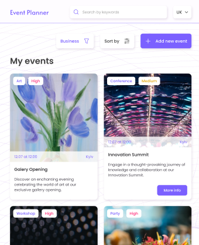
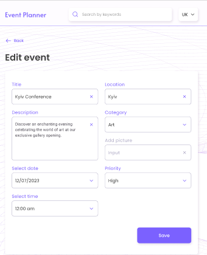
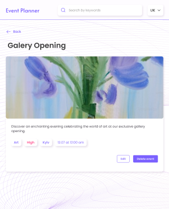
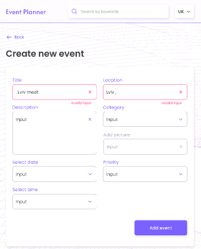

# E-planner app 📚 🖥️ 👨‍💻 📈

#### Demo 🖥️ 🚀 📅 🏦

### [GO TO LIVE DEMO PAGE HERE ](https://main--taupe-cascaron-c70994.netlify.app) 👀 🌀 📙

Event Planner is a web application that allows users to plan and organize events.

Structure:

Home page - a list of upcoming events with basic information about them. The ability to filter events by category. Events with different priorities are displayed in different colors.
Event creation page - a form for filling in the necessary information about the event (name, date, time, place, description, etc.).
Event page - detailed information about a specific event, including all the information filled in from the event creation page.
Event edit page - you can edit the completed form with information about the event, such as name, date, time, place, description, etc.

Features:
Sort events - sort events by different categories, by name, date, or priority.
Search for an event - search for an event by name or description using the inpt in the header.
Pagination on the main page.
Support for different languages.

The layout is fixed in px.
Layout is semantic and valid, accessibility will be a bonus (a11y).
Adaptive and cross-browser layout - mobile from 320px, tablet from 768px, desktop from 1280px.
Use the Mobile first approach.
The code should be clean, with formatting preserved. We recommend using ESLint/Prettier.
The code is divided into separate components.

##

 
 

##


## Installation and Usage ⚙️ 🚀 📅 💻

To get start application, follow these steps:

1.  Clone this repository to your local machine.
2.  Open the terminal and navigate to the project directory.
3.  Run the following commands:

```
# yarn package manager
yarn install
yarn start

# npm package manager
npm install
npm run start
```

Copy the repository to yourself

```shell
git clone https://github.com/BlackyHat/E-planner.git
```

## The web application using the following technologies and libraries: ⚙️ 🚧 🖥️

- JavaScript,
- TypeScript,
- React.js,
- Redux Toolkit,
- React Router Dom,
- Formik,
- Yup,
- React Date Picker,
- React Hot Toast,
- React Icons,
- Axios,
- SASS

## Stay in touch 🤠 💼 🕔 🏁

- Author - [Oleksandr Podoliako](https://github.com/BlackyHat)
- Linkedin - [http://linkedin.com/in/oleksandr-vp](http://linkedin.com/in/oleksandr-vp)
- Telegram - [@blackhatty](https://t.me/blackhatty)
